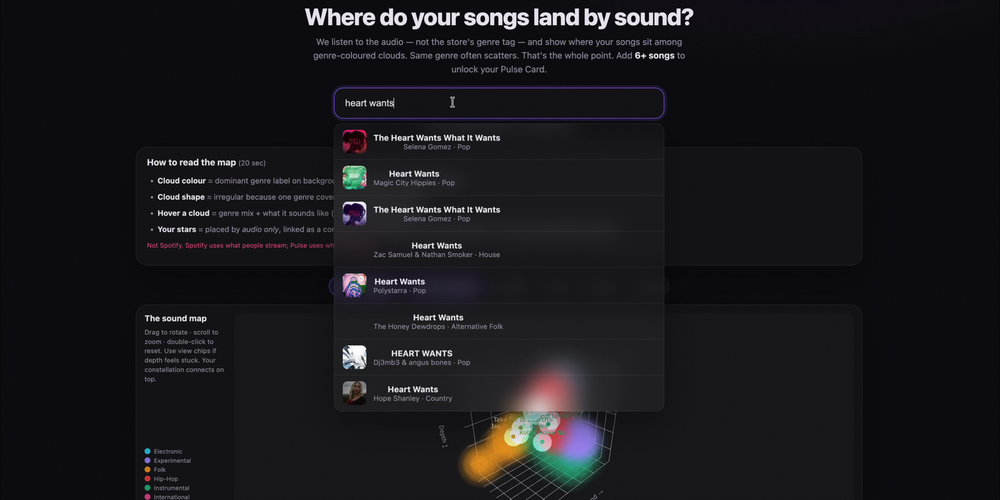
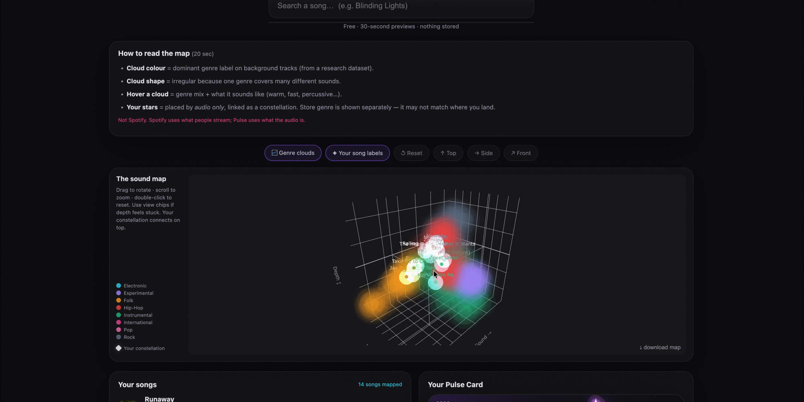
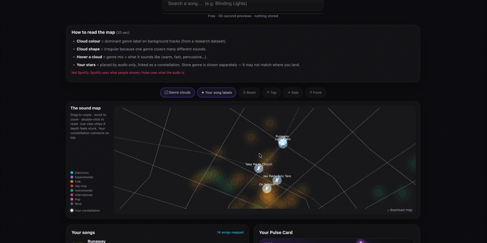
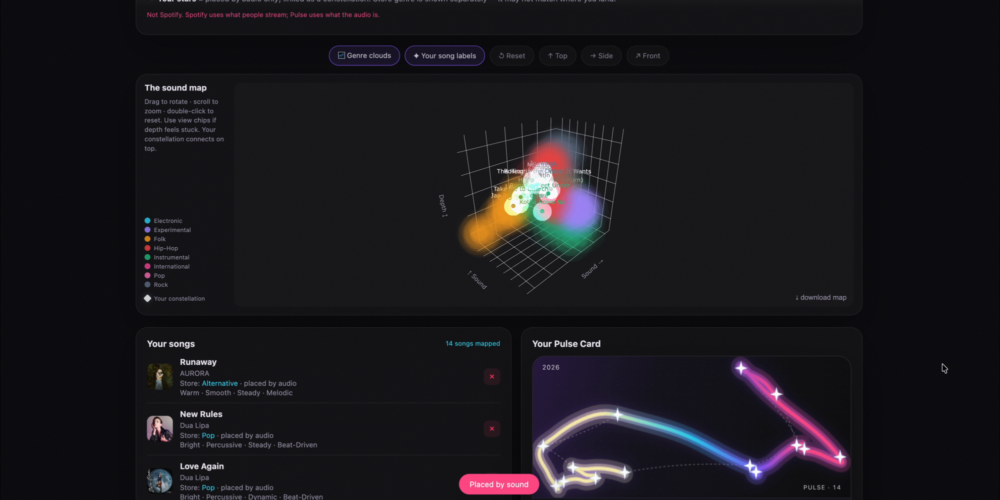

# Project Pulse 🎧

**Mapping musical taste by how songs *sound* — not by how crowds behave.**

Project Pulse is an unsupervised audio-analysis pipeline that explores a simple
question: *can the real, acoustic reasons behind my musical taste be measured —
and visualised — directly from sound?* It turns songs into a **768-dimensional
neural audio fingerprint**, projects them into an **interactive 3D map**, and makes
that map both **interpretable** (brightness, tempo, texture…) and **reusable**
(anyone can drop their own songs onto the same map).

It now ships as **Pulse** — a free web app where you search a song by name, watch it
land on a sound map among genre-coloured clouds, and get a shareable **Pulse Card**
of your acoustic signature.



---

## ✨ The Pulse web app

The latest chapter turns the research pipeline into something anyone can play with. No
account, no key, nothing stored — search a song, hear a 30-second preview, and see where
it lands **by audio**, not by the store's genre tag.

**Search by name → placed by sound.** An iTunes-powered autocomplete finds the track; the
backend pulls the 30-second preview, runs it through the AST neural model, and projects it
onto the shared map.



**One interactive 3D sound map.** Background clouds are genre regions from a research
dataset (colour = dominant genre). Your songs appear as **stars**, placed by audio only and
linked into a personal **constellation**. Hover a cloud for its genre mix + acoustic profile;
use the Reset / Top / Side / Front chips to navigate. The whole point: *the same genre
scatters across the map — genre ≠ sound.*



**Your Pulse Card.** Add 6+ songs to unlock a shareable card: a glowing signature path
through your songs, a taste-type name, and an 8-feature **bipolar signature**
(Warm↔Bright, Smooth↔Percussive, Steady↔Dynamic, Beat-driven↔Melodic…). Each mapped song
is tagged with its acoustic profile and honestly labelled *"placed by audio."*



**Highlights**

- 🔎 Type-a-name **autocomplete** (iTunes Search API — free, no key) + 30-second previews.
- 🌌 **Single 3D sound map** with genre-coloured clouds, star markers, and MST constellation links.
- 🃏 Downloadable **Pulse Card** with taste type + bipolar acoustic signature.
- 🎛️ Add/remove songs live; hover tooltips; map nav chips; **dark / light** themes.
- 🧭 Built-in *"How to read the map"* guide + an honest **About** section (not Spotify; FMA has a Western skew).

### Run the web app locally

```bash
# from the project root, with the virtual env set up (see "Run the analysis" below)
pulse_env/bin/uvicorn web.backend.server:app --port 8000
# then open http://localhost:8000
```

> Backend is a small **FastAPI** app (`web/backend/`) that loads the frozen atlas, proxies
> iTunes search, runs AST + interpretable features on the 30s clip, and projects it onto the
> map. Frontend is a plain HTML/CSS/JS SPA (`web/frontend/`). Needs `ffmpeg` for `.m4a`
> previews; the AST model is cached locally on first run. See `web/README.md` for details.

---

## Why I built this

Streaming recommenders (Spotify's Discover Weekly / AI DJ) lean heavily on
**collaborative filtering** — they learn from *collective listening behavior*
(co-listens, skips, saves). That works well for mainstream taste, but it carries
documented **popularity bias** and **cultural/country bias**: it under-serves
listeners whose taste spans languages and cultures, where co-listening data is thin
and skewed toward Western catalogs.

I listen across many cultures and languages, and the AI DJ kept missing. So instead
of asking *"what do similar people stream?"*, Project Pulse asks *"what does this song
actually sound like?"* and builds a taste-map from the audio itself.

## What I found (honestly)

The origin story is a personal case study — **1 listener, 99 songs, Like/Dislike labels** —
so these findings are about me, not a universal claim.

- **My likes and dislikes overlap heavily in sound.** Blind clustering can't cleanly
  separate them (clusters ~57% pure; silhouette ≈ 0.11). There is no neat acoustic wall.
- **Sound predicts my taste ~68%** vs a ~50% baseline — meaningful, but far from total.
- **Simple features (~69%) did about as well as the deep 768-D embedding (~68%)** at
  separating like/dislike. The deep map's value isn't a higher score — it's the
  *structure* (neighborhoods) and the ability to place *any* new song.
- **My taste type:** `Warm · Smooth · Steady · Melodic`.

**Takeaway:** taste = sound **+** culture/language/context. Sound explains part of it,
not most of it. A recommender tuned for the mainstream crowd naturally struggles with
a cross-cultural listener.

> A hypothesis I *raise but do not prove* here: because these systems optimise for
> collective behavior, they may nudge listeners toward more generic, popular taste.
> Testing that would need many listeners — out of scope for this personal project.

## How it works

```
song preview (30s .m4a / .wav)
   │
   ├─ AST neural model ─────────►  768-D sound embedding   ─► UMAP ─► 3D "Sound Map"
   │
   └─ librosa features ─────────►  8 named features        ─────────► bipolar signature
                                   (brightness, tempo, texture, dynamics, tonality…)
```

- **Sound Map** — the deep acoustic fingerprint (the "wow"), coloured by genre clouds.
- **Interpretable signature** — the same song on human-readable bipolar axes (the "aha").
- **Frozen reference space (UMAP)** — fit once and saved, so new songs project into the
  *same* coordinates later. (This is why UMAP replaced t-SNE — t-SNE can't place new points.)
- **The Atlas** — a genre-grounded backdrop built from **FMA** (Free Music Archive): 8
  genres × 40 = 320 CC-licensed 30s clips, embedded the same way. New songs land relative
  to it via a numba-free kNN placement, so it runs robustly on free CPU.

## See the maps

Open these standalone files in a browser (interactive, drag to rotate):

- `Project_Pulse_Sound_Map.html` — the deep sound map
- `Project_Pulse_Interpretable_Map.html` — the named-axis map
- `Project_Pulse_Atlas_Sound_Map.html` / `Project_Pulse_Atlas_Feature_Map.html` — the labelled genre Atlas

## Run the analysis

```bash
# 1. Create + activate a virtual environment, then install core deps
python3 -m venv pulse_env
source pulse_env/bin/activate
pip install -r requirements.txt

# 2. Register the kernel so Jupyter/VS Code can find it
python -m ipykernel install --user --name pulse_env --display-name "Python (pulse_env)"
```

Then open `pulse_pipeline.ipynb`, **select the "Python (pulse_env)" kernel**, and
Run All. It runs from the saved data in seconds — no audio processing required.

> To project *new* songs (the `place_audio_files` function) you also need the heavier
> audio engine: uncomment `librosa`, `torch`, `transformers` in `requirements.txt`.

## Repository structure

| Path | What it is |
|---|---|
| `web/` | **Pulse web app** — FastAPI backend (`web/backend/`) + SPA frontend (`web/frontend/`) |
| `pulse_pipeline.ipynb` | Main analysis notebook — runs from saved data |
| `pulse_core.py` | Reusable engine (extract, embed, project, taste type) |
| `Project_Pulse_Colab.ipynb` | "Drop your songs" Colab tool |
| `Project_Pulse_Atlas_Colab.ipynb` | Builds the genre Atlas on Colab GPU |
| `artifacts/` | Frozen reference space (scaler + UMAP + coordinates) |
| `atlas_artifacts/` | Frozen genre Atlas (sound + feature lenses, `atlas.csv`) |
| `project_pulse_neural_data.csv` | 99 songs × 768 AST dims + 3D coords |
| `project_pulse_interpretable_features.csv` | 99 songs × 8 named features |
| `Project_Pulse_*Map.html` | Interactive 3D maps |
| `result assets/` | Static charts from the analysis |
| `docs/screenshots/` | Web-app screenshots (used in this README) |

## Roadmap

- **v0 — analysis engine** ✅ clean notebook, frozen reusable map, honest findings.
- **v1 — "drop your songs" Colab** ✅ paste/upload songs, see where they land + your taste
  type, plus fun discoveries ("same genre, opposite ends of the map").
- **v2 — Pulse web app (Phase 1)** ✅ hosted-ready site: search-by-name, 30s previews, one
  interactive 3D sound map with genre clouds + constellation, and a shareable Pulse Card.
- **Next** ⬜ polish the Pulse Card header art + KDE/grain density on the map; **deploy**
  (frontend → Vercel, backend → HuggingFace Spaces); Phase 2 storage → public gallery +
  usernames + playlist import (Spotify-read → iTunes-preview).

## Honest limitations

- n = 1 listener, 99 songs — the origin story is a personal case study, not a population claim.
- The AST model is itself Western-trained; this project does **not** de-bias it. The
  honest edge is that the space is defined by *sound* (not behavior) and anchored on a
  deliberately cross-cultural corpus.
- The genre Atlas (FMA) skews Western / indie / electronic — not a complete global picture.
  That bias is called out in the app's About section.
- Pulse is **not** Spotify's algorithm. Spotify recommends from *what people stream*
  (collaborative filtering); Pulse places songs by *what the audio is*.

## References

- Dieleman & van den Oord, *Deep content-based music recommendation*, NIPS 2013.
- *Analyzing popularity/country bias in music recommenders*, arXiv:2408.11565.
- *Music for All: representational bias in music models*, NAACL Findings 2025.
- UK IPO, *Impact of algorithmically driven recommendation systems on music* (2023).
- Prior art: *Every Noise at Once* (Glenn McDonald) — maps genres by sound; Pulse differs by
  being open, song-level drop-in, and cross-cultural in emphasis.
